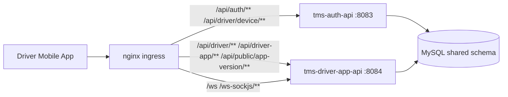

# SA Document (System Architecture)

Project: `sv-tms`  
Architecture style: split microservices (phase-1)

## 0) Visual Map

## 1) Big Picture (Simple)

Think of the system like 2 workers behind 1 front desk:
- Front desk: `nginx`
- Worker A: `tms-auth-api` (login, token, auth lifecycle)
- Worker B: `tms-driver-app-api` (driver mobile business APIs)

Both workers currently read/write the same main database schema.

## 2) Service Boundaries

### `tms-auth-api` owns
- `/api/auth/**`
- `/api/driver/device/**`

Responsibilities:
- login/refresh
- password flow
- token issuance and validation behavior
- device/reviewer login policy

### `tms-driver-app-api` owns
- `/api/driver/**`
- `/api/driver-app/**`
- `/api/public/app-version/**`
- `/ws`
- `/ws-sockjs/**`

Responsibilities:
- bootstrap/home data
- profile, assignment, dispatch, tracking session
- driver location/presence
- incidents/safety
- driver notifications and app-facing reads

## 3) Runtime Topology

- `nginx` -> public ingress
- `tms-auth-api` on `127.0.0.1:8083`
- `tms-driver-app-api` on `127.0.0.1:8084`
- `MySQL` shared DB (phase-1)
- `systemd` process management on VPS

## 4) API Contract Rules

- Mobile path contract stays stable in v1.
- JWT/refresh behavior stays compatible in v1.
- No driver mobile flow should depend on `/api/admin/**`.
- Only one service owns each public path.

## 5) Security Model

- JWT bearer auth
- shared signing config in v1
- service-level security config per microservice
- nginx path routing is part of security boundary (wrong route = wrong access surface)

## 6) Data Model (Current State)

- Shared DB and shared auth/driver tables in v1
- Shared refresh-token persistence
- Shared user/driver entities
- Future target: service-owned schemas after stable split operations

## 7) Deploy & Operations Contract

Must pass after deploy:

1. service health checks
2. routing smoke
3. OpenAPI ownership smoke
4. dynamic driver-policy smoke

Required markers:
- `MICROSERVICE_ROUTING_SMOKE_OK`
- `OPENAPI_SPLIT_SMOKE_OK`
- `DYNAMIC_DRIVER_POLICY_SMOKE_OK`

## 8) Observability

- service health endpoints:
  - `:8083/actuator/health`
  - `:8084/actuator/health`
- logs:
  - `journalctl -u tms-auth-api`
  - `journalctl -u tms-driver-app-api`
  - nginx access/error logs

## 9) Reliability & Rollback

- rollback with `prod_rollback_vps.sh`
- restart unit-level services independently
- route-level incident triage through nginx + service health

## 10) Known Technical Debt (Accepted for Phase-1)

- `tms-auth-api` and `tms-driver-app-api` still depend on code packaged in `tms-backend`
- shared DB across services
- limited service-local test suites in split modules

## 10.1) Temporary Dependency Note

In phase-1 split, both split services still compile against `tms-backend` classes.
This is intentionally temporary and should be removed in phase-2 extraction.

## 11) Phase-2 Architecture Goals

- move remaining shared business classes from `tms-backend` into proper shared libs or service-owned modules
- reduce cross-service compile coupling
- increase service-local integration tests
- prepare DB ownership split (bounded contexts)

## 11.1) Exit Criteria For Phase-2

- `tms-auth-api` builds without compile dependency on `tms-backend`
- `tms-driver-app-api` builds without compile dependency on `tms-backend`
- shared module contains only truly shared contracts/utilities
- service-local integration tests exist for key mobile flows
- deploy smoke scripts still pass unchanged markers

## 12) Source Of Truth Docs

- `docs/README.md`
- `docs/guides/INFRASTRUCTURE_GUIDE.md`
- `docs/guides/DEVELOPMENT_GUIDE.md`
- `docs/guides/ONGOING_MAINTENANCE_GUIDE.md`
- `docs/deployment/VPS_MAINTENANCE_AND_MONITORING_RUNBOOK.md`
